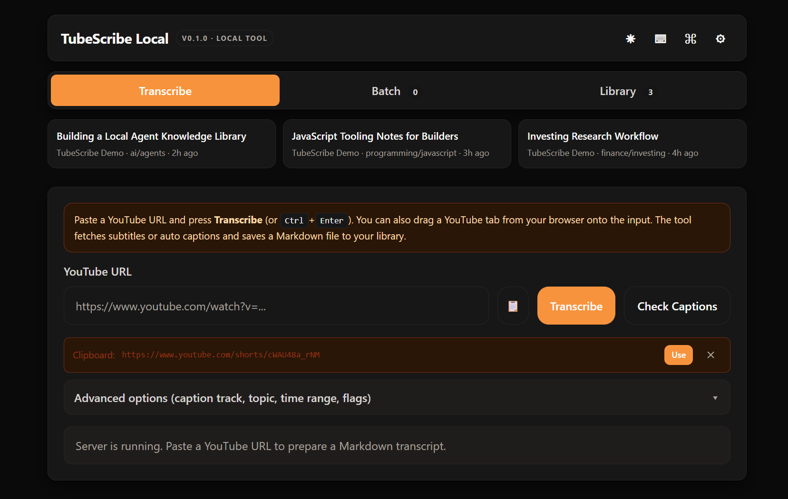
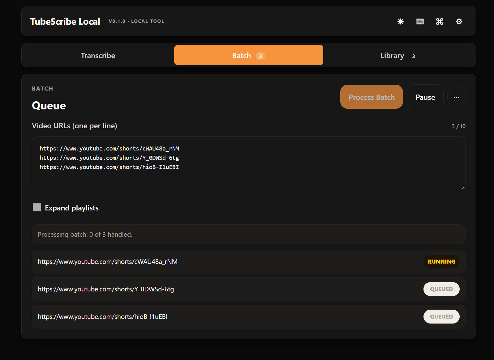
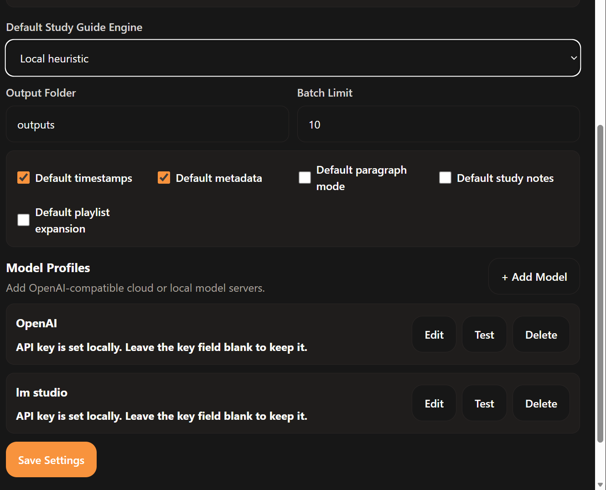

# TubeScribe Local

Local-first YouTube caption transcription tool that saves Markdown transcripts into a searchable knowledge library.

Current version: `v0.2.1`

The app fetches available YouTube subtitles or automatic captions through `yt-dlp`, writes Markdown as the primary artifact, creates TXT/JSON/SRT/VTT sidecar files, and maintains a local `library.json` index for agents and repeat use.

## Features

- Markdown-first transcript export.
- TXT, JSON, SRT, and VTT sidecar exports.
- Topic folders and rebuildable local `library.json` index.
- Library UI with search, preview, downloads, source links, and multi-select topic/tag filters.
- Caption track selection.
- Time range export and paragraph mode.
- Local heuristic study notes.
- Optional OpenAI-compatible API model profiles for explicit Study Guide and Topic Classification actions.
- Backend batch queue with pause/resume, cancel queued items, optional playlist expansion, persisted batch history, and ZIP download.
- Local Windows launch helpers.

## Project Layout

```text
Main/
  app.py
  transcriber.py
  index.html
  static/
  tests/
  requirements.txt
  start-tool.bat
  start-tool.ps1
  launch_tool.pyw
```

Generated files and local secrets are ignored by git:

```text
Main/local_settings.json
Main/batch_jobs.json
Main/outputs/
Main/server.*.log
Main/server.pid
```

## Quick Start

```powershell
cd Main
pip install -r requirements.txt
python app.py
```

Then open:

```text
http://127.0.0.1:8765
```

On Windows you can also run:

```powershell
.\start-tool.bat
```

## Using The Web UI

The app opens as a local browser workspace with three main tabs:

- `Transcribe`: paste a YouTube URL, optionally check caption tracks, adjust advanced options, and generate Markdown/TXT/JSON/SRT/VTT outputs.
- `Batch`: paste several video URLs, run them sequentially, pause or resume between videos, cancel queued items, optionally expand playlists, and download completed files as a ZIP.
- `Library`: search saved transcripts, filter by topics/tags/channels/language, preview Markdown, open source YouTube links, download sidecar files, repair the local index, generate Study Guides, and classify topics with a selected AI engine.

Use the gear button in the top-right corner to configure output folder, batch limit, default transcript options, and optional OpenAI-compatible model profiles. API models are only used when you explicitly select them for Study Guide or Topic Classification actions.

Saved model profiles include a `Test` action. It sends only a tiny connection-test prompt to the configured OpenAI-compatible endpoint, not transcript text.

The UI also includes a dark-mode toggle, keyboard shortcut help, and a command palette entry point in the top bar.

## Screenshots







## Library Schema

Transcript Markdown files and sidecar files are the durable artifacts. `library.json` is a rebuildable index for the UI and agents. If it drifts after manual file edits, use `Repair Index` in the Library tab to rescan the active output folder.

Schema details are documented in `docs/library-schema.md`.

Example Markdown output: `docs/examples/sample-transcript.md`.

## Settings

Copy `Main/local_settings.example.json` only if you want a starting point for local settings. The app can also create `Main/local_settings.json` through the Settings modal.

Do not commit `Main/local_settings.json`; it can contain API keys.

## Troubleshooting

### The page does not work when opening `index.html`

Run the local server instead of opening the HTML file directly. Use `python app.py` from `Main`, then open `http://127.0.0.1:8765`, or run `start-tool.bat` on Windows.

### YouTube captions are missing

Some videos have no accessible subtitles or automatic captions. Click `Check Captions` first to see available tracks. Private, region-limited, members-only, or unavailable videos usually cannot be transcribed by this caption-only version.

### YouTube rate limits or upstream changes

If previously working videos suddenly fail, update `yt-dlp` and try again later. YouTube extractor behavior changes often, and rate limits can be temporary. The Settings modal shows local yt-dlp diagnostics so you can confirm the installed package/command status.

### PO Tokens, cookies, and login

TubeScribe Local does not use YouTube cookies, login, or PO Tokens by default. Those flows can expose private account data and should stay explicit opt-in if they are ever added.

### Output files are not where expected

The default output folder is `Main/outputs`. If you changed `Output Folder` in Settings, new transcripts and `library.json` are written there instead. Existing transcripts are not moved automatically.

If Markdown files exist but the Library tab is missing entries, click `Repair Index`. It rebuilds `library.json` from transcript Markdown files without moving or editing the transcripts.

### Local model endpoint does not work

Local models usually need a running OpenAI-compatible server such as Ollama or LM Studio. Make sure the base URL includes the API path, for example `http://localhost:11434/v1`, and that the model name matches the local server.

For LM Studio, the usual base URL is `http://127.0.0.1:1234/v1` after the local server is started. Smaller local models can have short context windows, while larger-context local models may accept far more transcript text. Each model profile can set Study Guide source count, input character budget and output token budget.

After saving a model profile, use `Test` in Settings to confirm the endpoint responds before using it for Study Guides or Topic Classification.

### Port 8765 is busy

Close the existing TubeScribe Local window/server first. If another process is using the port, stop that process or change the app port in code before starting again.

## Tests

Run from `Main`:

```powershell
python -m unittest discover -s tests
python -m py_compile app.py transcriber.py launch_tool.pyw
node --check static\app.js
```

The automated tests avoid live YouTube/API calls.

## Security And Privacy

This is a local single-user tool. It is not a production web server. Transcript text stays local unless you explicitly choose an API model profile for Study Guide generation or Topic Classification.

See `SECURITY.md` before publishing, deploying, or accepting contributions.

## License

Apache License 2.0. See `LICENSE` and `NOTICE`.
